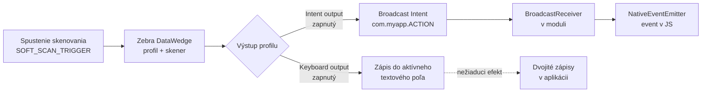
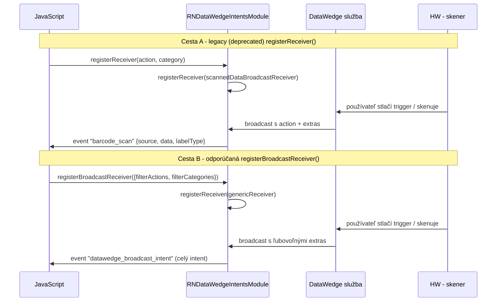

# Nastavenie DataWedge

Modul **nie je sám o sebe čítačkou** – je iba mostom medzi JavaScriptom a službou **Zebra DataWedge**.
Bez správne nakonfigurovaného DataWedge modul nebude zachytávať žiadne udalosti a ani ich nebude odosielať na skener.

Služba DataWedge musí byť na zariadení:

1. **nainštalovaná** (predinštalovaná na zariadeniach Zebra),
2. **povolená** (zapnutá),
3. **nakonfigurovaná** tak, aby posielala **Intent broadcasty** s výsledkom skenovania.

Oficiálna dokumentácia: <https://techdocs.zebra.com/datawedge/latest/guide/api/>

---

## 1. Koncept – ako to funguje

---

## 2. Vytvorenie / úprava profilu

Otvor **DataWedge** na zariadení a vytvor alebo uprav profil priradený k tvojej aplikácii
(názov profilu = názov balíka aplikácie, napr. `com.mojaapp`).

V profile je potrebné nastaviť:

| Sekcia v profile | Nastavenie | Dôvod |
|---|---|---|
| **Barcode input** (Vstup čiarového kódu) | povolený | inak skener nepracuje |
| **Intent output** (Výstup – Intent) | **zapnutý** | zabezpečí odoslanie broadcastu po skenovaní |
| **Intent output → Action** | vlastná akcia, napr. `com.mojaapp.ACTION` | musí sa zhodovať s `filterActions` v `registerBroadcastReceiver` |
| **Intent output → Delivery** | **Broadcast** | modul počúva práve broadcast receivers |
| **Intent output → Data to output** | `com.symbol.datawedge.data_string`, `com.symbol.datawedge.label_type`, `com.symbol.datawedge.source` | tieto kľúče modul mapuje do udalosti `barcode_scan` |
| **Keyboard output** (Výstup klávesnice) | **vypnutý** | inak dôjde k zápisu skenu aj do textového poľa (dvojité spracovanie) |

Referenčná snímka konfigurácie z repozitára (obsah nie je súčasťou tohto textu):

- `screens/datawedge.png`

### Dôležité upozornenie k Keyboard outputu

Zapnutý keyboard output spôsobuje, že DataWedge „napíše" naskenovaný reťazec do práve fokusovaného
widgetu. Ak aplikácia spracúva skeny cez intent, musí byť keyboard output **vypnutý**:
<https://developer.zebra.com/message/95397>

---

## 3. Dva prístupy k získaniu dát

Modul podporuje dva spôsoby, ako sa k dátam zo skenera dostať:

| Cesta | Metóda | Udalosť | Stav |
|---|---|---|---|
| A | `registerReceiver({action, category})` | `barcode_scan` | ❌ zastarané |
| B | `registerBroadcastReceiver({filterActions, filterCategories})` | `datawedge_broadcast_intent` | ✅ odporúčané |

> V ceste B modul do intentu pridá kľúč `v2API = true`, podľa ktorého rozlíši, že má odoslať
> udalosť `datawedge_broadcast_intent`.

---

## 4. DataWedge API (DP API) – príkazy

Pre väčšinu operácií sa používa **jediná akcia** `com.symbol.datawedge.api.ACTION` plus príslušné extras.
Odosielajú sa metódou `sendBroadcastWithExtras` (pozri [api-referencia.md](./api-referencia.md)).

| Účel | Extra kľúč | Hodnota |
|---|---|---|
| Spustiť soft sken | `com.symbol.datawedge.api.SOFT_SCAN_TRIGGER` | `START_SCANNING` / `STOP_SCANNING` / `TOGGLE_SCANNING` |
| Zapnúť/vypnúť skenerovací plugin | `com.symbol.datawedge.api.SCANNER_INPUT_PLUGIN` | `ENABLE_PLUGIN` / `DISABLE_PLUGIN` |
| Zapnúť/vypnúť DataWedge | `com.symbol.datawedge.api.ENABLE_DATAWEDGE` | `true` / `false` |
| Nastaviť predvolený profil | `com.symbol.datawedge.api.SET_DEFAULT_PROFILE` | názov profilu |
| Resetovať predvolený profil | `com.symbol.datawedge.api.RESET_DEFAULT_PROFILE` | – |
| Prepnúť profil (dočasne) | `com.symbol.datawedge.api.SWITCH_TO_PROFILE` | názov profilu |
| Vytvoriť profil | `com.symbol.datawedge.api.CREATE_PROFILE` | názov profilu |
| Konfigurovať profil | `com.symbol.datawedge.api.CONFIGURE_PROFILE` | názov + JSON konfigurácia |
| Vymenovať skenery | `com.symbol.datawedge.api.ENUMERATE_SCANNERS` | – |
| Verzia API | `com.symbol.datawedge.api.GET_VERSION_INFO` | – |
| Vyžiadať odpoveď | `SEND_RESULT` | `true` |

Odpoveď DataWedge prichádza na akciu **`com.symbol.datawedge.api.RESULT_ACTION`** (treba ju pridať do
`filterActions`), kľúčové extras:

| Extra kľúč | Význam |
|---|---|
| `com.symbol.datawedge.api.RESULT_STATUS` | `SUCCESS` / `FAILURE` / `CONFIGURATION_NOT_SUPPORTED` |
| `com.symbol.datawedge.api.RESULT_PROFILE` | názov profilu |
| `com.symbol.datawedge.api.RESULT_VERSION` | verzia DataWedge |
| `com.symbol.datawedge.api.RESULT_SCAN_DATA` | naskenované dáta (ak sú súčasťou odpovede) |

Kompletné príklady volaní: [priklady-pouzitia.md](./priklady-pouzitia.md).

---

## 5. Zastarané akcie (legacy API)

Tieto akcie modul stále pozná (konštanty `ACTION_*`), ale **nie sú už odporúčané** – nesledujú
nový DataWedge API a nebudú rozšírené o nové funkcie:

| Konštanta | Hodnota |
|---|---|
| `ACTION_SOFTSCANTRIGGER` | `com.symbol.datawedge.api.ACTION_SOFTSCANTRIGGER` |
| `ACTION_SCANNERINPUTPLUGIN` | `com.symbol.datawedge.api.ACTION_SCANNERINPUTPLUGIN` |
| `ACTION_ENUMERATESCANNERS` | `com.symbol.datawedge.api.ACTION_ENUMERATESCANNERS` |
| `ACTION_SETDEFAULTPROFILE` | `com.symbol.datawedge.api.ACTION_SETDEFAULTPROFILE` |
| `ACTION_RESETDEFAULTPROFILE` | `com.symbol.datawedge.api.ACTION_RESETDEFAULTPROFILE` |
| `ACTION_SWITCHTOPROFILE` | `com.symbol.datawedge.api.ACTION_SWITCHTOPROFILE` |

Ak legacy akciu použiješ, modul automaticky zvolí správny kľúč extras:

- pre `SET/RESET/SWITCHTOPROFILE` → `com.symbol.datawedge.api.EXTRA_PROFILENAME`
- pre ostatné → `com.symbol.datawedge.api.EXTRA_PARAMETER`

---

## 6. Checklista nasadenia

- [ ] DataWedge je nainštalovaný a **zapnutý**
- [ ] V profile aplikácie je **Intent output zapnutý** s delivery = **Broadcast**
- [ ] Action v profile sa **zhoduje** s `filterActions` v `registerBroadcastReceiver`
- [ ] **Keyboard output je vypnutý**
- [ ] V `filterActions` je aj `com.symbol.datawedge.api.RESULT_ACTION` (ak chceš odpovede na príkazy)
- [ ] Listener je zaregistrovaný cez `NativeEventEmitter` (pozri [troubleshooting.md](./troubleshooting.md))
- [ ] Aplikácia beží vo **development builde**, nie v Expo Go

---

## 7. Odkazy

- DataWedge API: <https://techdocs.zebra.com/datawedge/latest/guide/api/>
- DataWedge dokumentácia (všeobecne): <https://techdocs.zebra.com/>
- Príklad aplikácie: <https://github.com/darryncampbell/DataWedgeReactNative>
- Základná ukážka: <https://github.com/darryncampbell/RNDataWedgeIntentDemo>
