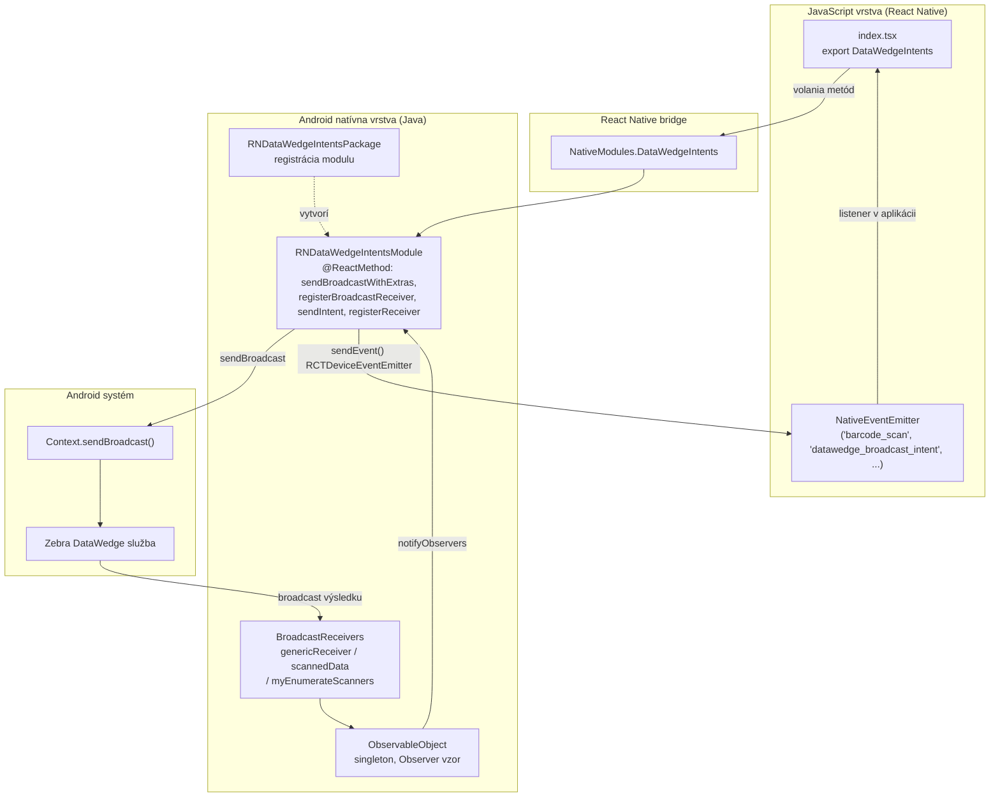
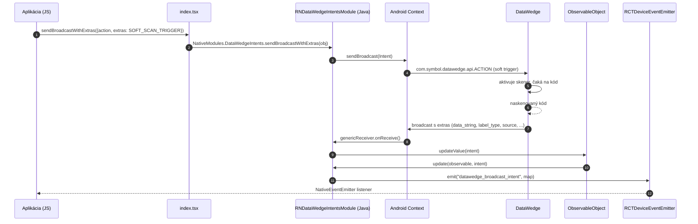
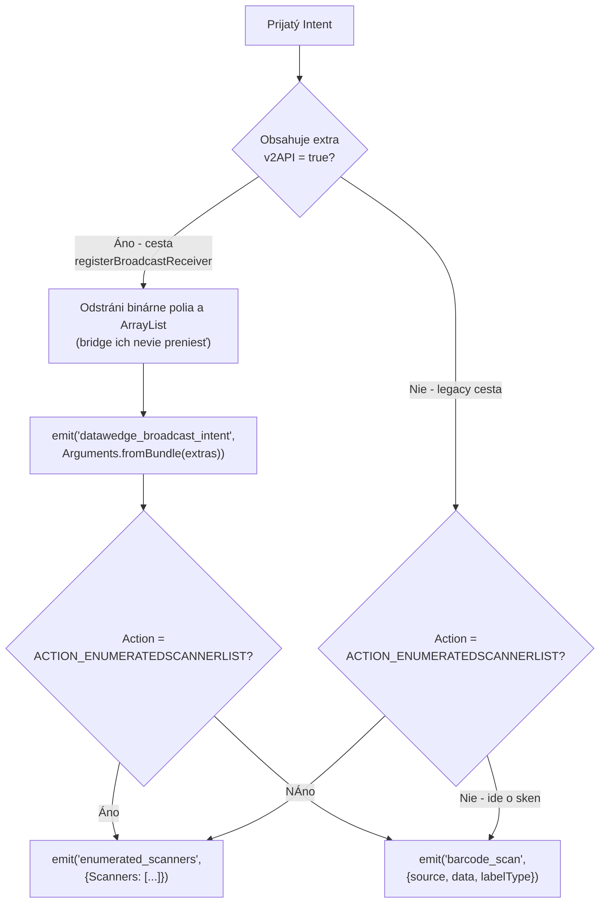
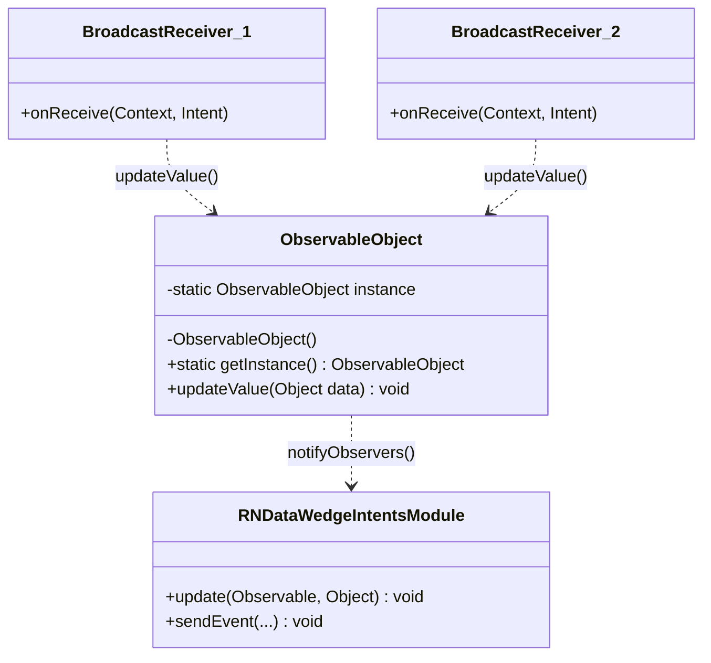
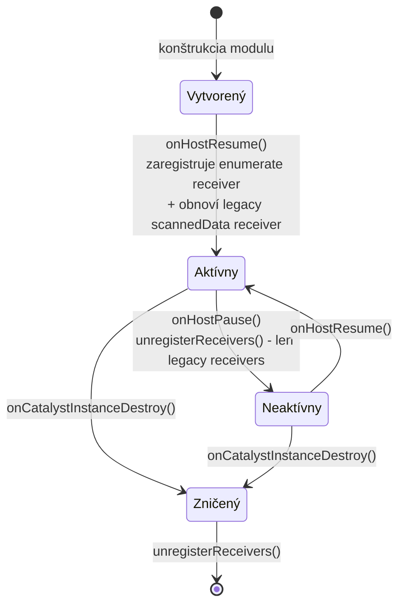
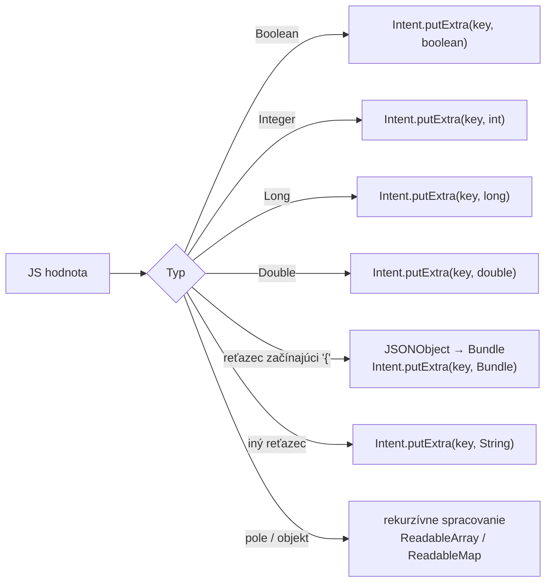

# Architektúra modulu

Modul tvorí **tenký most** medzi JavaScriptom a Android Intent systémom. Neobsahuje žiadnu vlastnú
logiku skenovania – všetku prácu vykoná služba **Zebra DataWedge**, modul len:

- odosiela **broadcast intenty** do DataWedge (príkazy),
- **registruje broadcast receivers** a presmerováva prijaté intenty do JavaScriptu ako eventy.

---

## 1. Vrstvy riešenia

---

## 2. Súbory modulu

| Súbor | Úloha |
|---|---|
| `index.tsx` | JS/TS vstup modulu, typy, re-export konštánt a metód z `NativeModules.DataWedgeIntents`; na ne-Android platformách ostáva export `undefined` |
| `android/src/main/java/.../RNDataWedgeIntentsModule.java` | Jadro modulu – `@ReactMethod` metódy, receivers, konštanty, odosielanie eventov |
| `android/src/main/java/.../RNDataWedgeIntentsPackage.java` | `ReactPackage` – registrácia natívneho modulu do RN |
| `android/src/main/java/.../ObservableObject.java` | Singleton rozširujúci `java.util.Observable` – spája `BroadcastReceiver` (producent) s modulom (konzument) |
| `android/build.gradle` | Build konfigurácia knižnice |
| `android/src/main/AndroidManifest.xml` | Prázdny manifest (iba package declaration) |
| `package.json` | `main: index.tsx`, peer závislosť `react-native >= 0.56` |
| `screens/datawedge.png` | Obrázková príloha – snímka konfigurácie DataWedge (obsah sa v dokumentácii nepoužíva) |

---

## 3. Tok dát – soft trigger + skenovanie

---

## 4. Spracovanie prijatého intentu v module

Metóda `update(Observable, Object)` je srdcom spätnej cesty. Rozhoduje podľa typu intentu:

### Dôležité správanie

1. **Každý intent z cesty B sa dostane aj do `barcode_scan`** – modul po odoslaní
   `datawedge_broadcast_intent` ešte pokračuje v klasifikácii podľa action. Ak intent neobsahuje
   kľúče `com.symbol.datawedge.*`, event `barcode_scan` príde s hodnotami `null`.
2. **Polia sú odstránené** – `byte[]` a `ArrayList` extra kľúče sa z intentu odstránia, pretože
   React Native bridge nevie preniesť binárne polia. Očakávaj teda len skalárne hodnoty a objekty.
3. **`v2API` extra** je vnútorný príznak pridaný modulom, nie odoslaný DataWedge.

---

## 5. Model odosielania – Observer

`BroadcastReceiver` beží na Android strane a nemá priamy prístup k React contextu prenosu udalostí.
Modul preto používa jednoduchý **Observer vzor** cez singleton `ObservableObject`:

Poznámky k implementácii:

- `ObservableObject` je **thread-safe** (`synchronized` v `updateValue`).
- Do singletonu sa modul **registruje vo svojom konštruktore** (`addObserver(this)`).
- Keďže `Observable` je **deprecovaná trieda v Jave**, je to miesto, ktoré môže v budúcnosti
  vyžadovať úpravu (napr. prechod na `LiveData` alebo vlastný listener).

---

## 6. Životný cyklus a registry receiverov

Modul implementuje `LifecycleEventListener` (`onHostResume` / `onHostPause` / `onHostDestroy`)
a `onCatalystInstanceDestroy`.

| Receiver | Používa ho | Registruje | Odregistrováva pri pause |
|---|---|---|---|
| `myEnumerateScannersBroadcastReceiver` | `ACTION_ENUMERATEDLISET` (legacy) | `onHostResume()` | ✅ áno |
| `scannedDataBroadcastReceiver` | legacy `registerReceiver()` | `registerReceiver()` | ✅ áno (a opätovne pri resume) |
| `genericReceiver` | `registerBroadcastReceiver()` (odporúčané) | `registerBroadcastReceiver()` | ❌ **nie** – ostáva registrovaný |

> Všetky receivers sa registrujú s príznakom **`RECEIVER_EXPORTED`** – to je vyžadované od
> **Android 14 (API 34)** a zároveň umožňuje prijímať broadcasty z DataWedge (iná aplikácia).
> Pozri aj [troubleshooting.md](./troubleshooting.md).

---

## 7. Typ konvertácie extras pri odosielaní

`sendBroadcastWithExtras` dekonštruuje JS objekt na Android `Intent`:

JSON objekty sa konvertujú na `Bundle` cez `toBundle()` – podporuje reťazce, booleany, čísla,
polia reťazcov/čísel a vnoorené objekty.

---

## 8. Obmedzenia návrhu

| Obmedzenie | Popis |
|---|---|
| Android-only | iOS implementácia neexistuje, `DataWedgeIntents` je `undefined` |
| Bez Codegen / TurboModule | modul je klasický `ReactContextBaseJavaModule`; na New Architecture funguje cez interop vrstvu |
| Bez `addListener` / `removeListeners` | `new NativeEventEmitter()` volaj **bez argumentu** (s `NativeModules.DataWedgeIntents` ako argumentom by RN vypísalo varovanie) – eventy idú cez globálny `RCTDeviceEventEmitter` |
| Callbacky sa nedajú opakovať | modul preto posiela skeny ako **eventy**, nie cez `Callback` |
| Zastarané API | konštanty `ACTION_*`, `sendIntent()`, `registerReceiver()` – pozri [api-referencia.md](./api-referencia.md) |
| Zastaraná Javadoc trieda | `java.util.Observable` / `Observer` |
| `@providesModule` hlavička | `index.tsx` obsahuje zastaranú haste direktívu, ktorá nemá v modernom RN význam |
