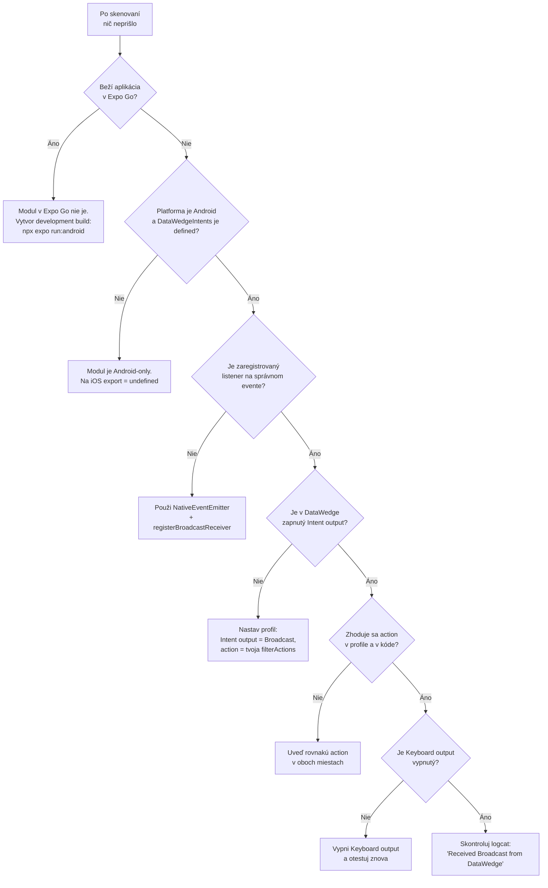

# Riešenie problémov (troubleshooting)

Rýchla diagnostika najčastejších problémov s modulom `react-native-datawedge-intents`.

---

## 1. Rozhodovací diagram – „sken nefunguje"



---

## 2. Časté problémy

| Príznak | Pravdepodobná príčina | Riešenie |
|---|---|---|
| `DataWedgeIntents` je `undefined` | modul nie je prepojený alebo si na iOS | over autolinking, skontroluj `Platform.OS === 'android'` |
| Import hlási `undefined` pri defaultnom importe | balík nemá `export default` | použi `import { DataWedgeIntents } from '...'` |
| Žiadny event po naskenovaní | nie je zapnutý Intent output alebo nesedí action | [nastavenie-datawedge.md](./nastavenie-datawedge.md) |
| Prichádza `barcode_scan` s `null` hodnotami | intent neobsahuje `com.symbol.datawedge.*` extras | nastav v profile „Data to output" – data_string, label_type, source |
| Sken sa zapíše aj do textového poľa | zapnutý Keyboard output | vypni Keyboard output v profile |
| Dvojité spracovanie skenu | počúvaš `barcode_scan` **aj** `datawedge_broadcast_intent` | ponechaj si len jeden event |
| Varovanie `new NativeEventEmitter() was called with a non-null argument without the required addListener method` | do konštruktora bol odovzdaný natívny modul, ktorý nemá `addListener`/`removeListeners` | vytváraj `new NativeEventEmitter()` **bez argumentu** |
| `NullPointerException` v `sendBroadcastWithExtras` | chýba kľúč `extras` | vždy odosielaj `extras` objekt |
| Padá to pri `registerReceiver` na starom Androide | modul volá 3-argumentovú verziu `registerReceiver(receiver, filter, flags)` (od API 26) | používaj zariadenia s Android 8.0+ |
| `SecurityException` / `IllegalArgumentException` pri registrácii | iná aplikácia už drží receiver alebo chýba export flag | modul používa `RECEIVER_EXPORTED`; prever konflikt mien receiverov |
| Eventy chodia, ale `data` je prázdne | DataWedge neposiela `data_string` (neaktivovaný výstup) | zapni všetky checkboxy „Data to output" |

---

## 3. Ako sledovať, čo sa deje

### 3.1 Logy React Native / modulu

Modul loguje pod tagom = názov triedy (`RNDataWedgeIntentsModule`):

```bash
# Android
adb logcat -s RNDataWedgeIntentsModule
```

Očakávané správy:

| Správa | Význam |
|---|---|
| `Constructing React native DataWedge intents module` | modul bol vytvorený |
| `Registering an Intent filter for action: ...` | zavolané `registerReceiver()` |
| `Sending Intent with action: ...` | zavolané `sendIntent()` |
| `Received Broadcast from DataWedge` | prišiel broadcast (genericReceiver) |
| `Received Broadcast from DataWedge API - Scanner` | prišiel legacy sken |
| `Received Broadcast from DataWedge API - Enumerate Scanners` | odpoveď enumerácie |

### 3.2 Logy DataWedge

```bash
adb logcat | findstr /I datawedge      # Windows
adb logcat | grep -i datawedge         # macOS / Linux
```

Ak v logoch DataWedge vidíš odoslanie intentu, ale v aplikácii event nie – problém je na strane
registrácie receivera (action/category filter). Ak DataWedge intent neodosiela vôbec – problém
je v konfigurácii profilu.

### 3.3 Logy aplikácie

```tsx
import { NativeEventEmitter } from 'react-native';

// bez argumentu – modul nemá addListener/removeListeners
const datawedgeEmitter = new NativeEventEmitter();

datawedgeEmitter.addListener('datawedge_broadcast_intent', (e) =>
  console.log('DW intent:', JSON.stringify(e, null, 2)),
);
datawedgeEmitter.addListener('barcode_scan', (e) =>
  console.log('Sken:', JSON.stringify(e)),
);
```

---

## 4. Kontrolný zoznam (checklist)

- [ ] Aplikácia beží vo **development builde** (nie Expo Go) – pozri [instalacia.md](./instalacia.md)
- [ ] Platforma je **Android**
- [ ] Použitý je **named import**: `import { DataWedgeIntents } from 'react-native-datawedge-intents'`
- [ ] Zavolané je `registerBroadcastReceiver(...)` **pred** prvým skenom
- [ ] Listener je na `NativeEventEmitter` (vytvorený bez argumentu) a na evente `datawedge_broadcast_intent`
- [ ] V DataWedge je **Intent output zapnutý**, delivery = **Broadcast**
- [ ] Action v profile = prvá položka v `filterActions`
- [ ] **Keyboard output je vypnutý**
- [ ] Pri unmount sa listener `sub.remove()` – inak hrozia dvojité eventy po re-registrácii
- [ ] Skúsené na konkrétnom zariadení Zebra so zapnutým DataWedge

---

## 5. Známe obmedzenia a riziká

### 5.1 Zastarané (deprecated) časti API

| Časť | Nahraď pomocou |
|---|---|
| `sendIntent()` | `sendBroadcastWithExtras()` |
| `registerReceiver()` | `registerBroadcastReceiver()` |
| `ACTION_*` konštanty | priame hodnoty DP API (`com.symbol.datawedge.api.*`) |
| `START_/STOP_/TOGGLE_SCANNING` konštanty | reťazce priamo v `extras` |
| event `enumerated_scanners` (legacy cesta) | `datawedge_broadcast_intent` + `SEND_RESULT` |

Dôvod: modul nesleduje aktuálny DataWedge API a nové konštanty sa už do modulu nepridávajú.

### 5.2 Registrácia receiverov a životný cyklus

- **Legacy receivers** (`registerReceiver`) sa odregistrovávajú pri `onHostPause()` a vracajú
  pri `onHostResume()`.
- **Nový receiver** (`registerBroadcastReceiver`) sa pri pause **neodregistrováva** – ak to
  potrebuješ, urob to ručne (fork modulu).
- Receivery sa odregistrovávajú aj pri `onCatalystInstanceDestroy()`.

### 5.3 Android 14+ (API 34)

Modul pri registrácii používa **`RECEIVER_EXPORTED`**, čo je povinné od Android 14 a zároveň
umožňuje prijímať broadcasty z inej aplikácie (DataWedge). V pôvodnom README sa spomína
`RECEIVER_NOT_EXPORTED` – **aktuálny kód v repozitári používa `RECEIVER_EXPORTED`**
(platné pre `registerReceiver()`, `registerBroadcastReceiver()` aj enumerate receiver).

### 5.4 Prenos dát cez bridge

- Z intentu sa **odstraňujú** `byte[]` a `ArrayList` extras – do JS sa nedostanú.
- `Callback` sa na opakované udalosti nehodí – preto výlučne eventy.
- `java.util.Observable` je v Jave deprecovaný; ide o technický dlh modulu.

### 5.5 Expo a New Architecture

- **Expo Go nie je podporovaný** – nutný development build.
- Modul **nemá `codegenConfig`** ani Expo config plugin; na New Architecture funguje cez
  interop vrstvu pre legacy natívne moduly. Ak projekt beží v režime *bridgeless* a modul
  nefunguje, otestuj na RN projekte s vypnutou New Architecture (`newArchEnabled: false`).

### 5.6 Build varovania

`android/build.gradle` má fallback `compileSdkVersion 27` / `buildToolsVersion 27.0.3`.
Projekt by mal definovať vlastné hodnoty v `rootProject.ext` (inak build zlyhá alebo skompiluje
proti starému API).

---

## 6. Hlásenia chýb

Ak narazíš na chybu modulu, priprav:

1. verziu modulu (`react-native-datawedge-intents` – `0.1.8`),
2. verziu React Native / Expo SDK,
3. model zariadenia Zebra a verziu Androidu,
4. verziu DataWedge,
5. výstup `adb logcat -s RNDataWedgeIntentsModule`,
6. ukážkový kód (registrácia receivera + listener).

Repozitár: <https://github.com/darryncampbell/react-native-datawedge-intents/issues>

---

## 7. Užitočné odkazy

- DataWedge API: <https://techdocs.zebra.com/datawedge/latest/guide/api/>
- Zebra tech docs: <https://techdocs.zebra.com/>
- Príklad: <https://github.com/darryncampbell/DataWedgeReactNative>
- Základná ukážka: <https://github.com/darryncampbell/RNDataWedgeIntentDemo>
- Keyboard output téma: <https://developer.zebra.com/message/95397>
